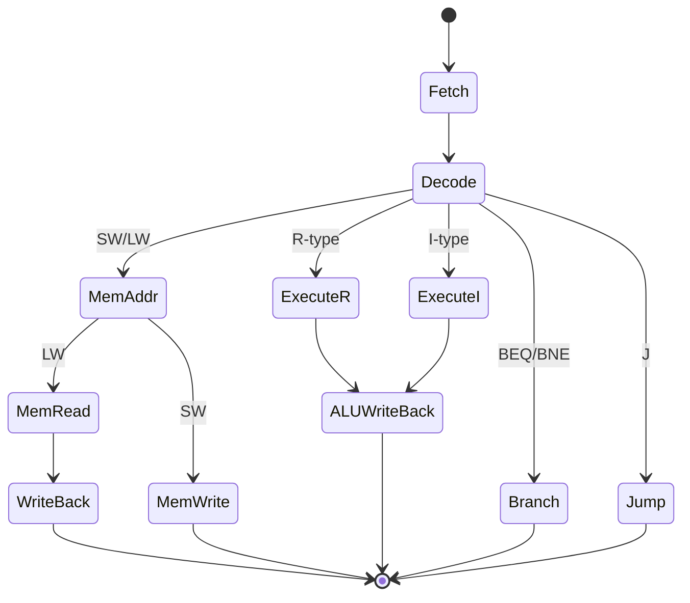
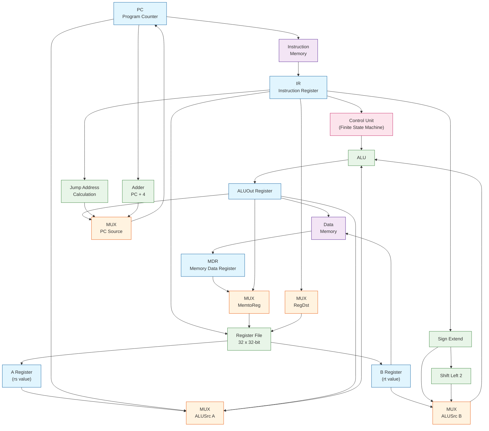
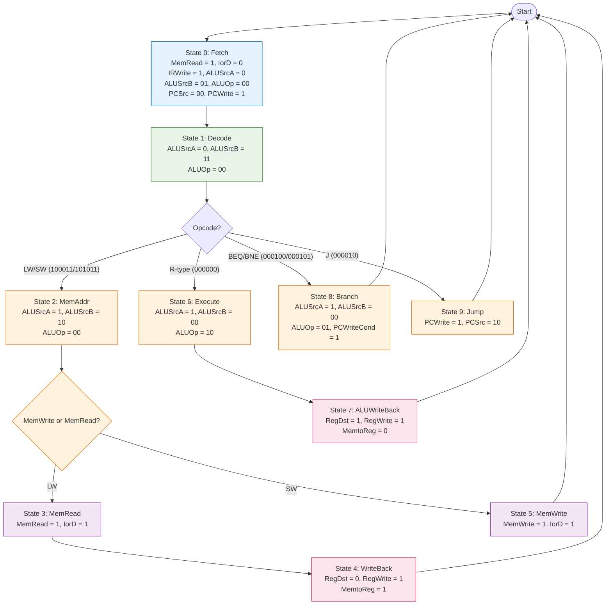

# Multi-Cycle MIPS Processor

## Overview
This is a Verilog implementation of a multi-cycle MIPS processor based on the design described in "Digital Design and Computer Architecture" by David Harris and Sarah Harris. Unlike single-cycle designs, this processor executes instructions over multiple clock cycles, reusing hardware components and allowing different instruction types to complete in varying cycle counts.

## Features
- **32-bit architecture** with 32 general-purpose registers
- **Multi-cycle execution**: Instructions complete in 3-5 clock cycles
- **Variable instruction timing**: Different instruction types take different cycles
- **Hardware reuse**: Single ALU used across multiple execution phases
- **Finite State Machine control**: Sequential control logic replaces combinational
- **Shared memory interface**: Single memory unit for both instructions and data
- **Instruction timing by type**:
  - R-type (ADD, SUB, AND, OR, SLT): 4 cycles
  - I-type (ADDI, ANDI, ORI, SLTI): 4 cycles
  - Load (LW): 5 cycles
  - Store (SW): 4 cycles
  - Branch (BEQ, BNE): 3 cycles
  - Jump (J): 3 cycles

## Architecture

### Multi-Cycle Execution Phases

### Datapath Diagram

### Control Unit: Finite State Machine

### Execution Cycles by Instruction Type

| Instruction Type | Cycles | Stage 1 | Stage 2 | Stage 3 | Stage 4 | Stage 5 |
|------------------|--------|---------|---------|---------|---------|---------|
| **R-type** (ADD, SUB, AND, OR, SLT) | 4 | Fetch | Decode | Execute | WriteBack | - |
| **I-type** (ADDI, ANDI, ORI, SLTI) | 4 | Fetch | Decode | Execute | WriteBack | - |
| **Load** (LW) | 5 | Fetch | Decode | MemAddr | MemRead | WriteBack |
| **Store** (SW) | 4 | Fetch | Decode | MemAddr | MemWrite | - |
| **Branch** (BEQ, BNE) | 3 | Fetch | Decode | Branch | - | - |
| **Jump** (J) | 3 | Fetch | Decode | Jump | - | - |

### Control Signals Table

| Signal | Width | Description | Values/Meaning |
|--------|-------|-------------|----------------|
| **PCWrite** | 1-bit | Program Counter write enable | 0: Disable, 1: Enable |
| **PCWriteCond** | 1-bit | Conditional PC write (branch) | 0: Disable, 1: Enable if zero |
| **IorD** | 1-bit | Memory address source | 0: PC, 1: ALUOut |
| **MemRead** | 1-bit | Memory read enable | 0: Disable, 1: Enable |
| **MemWrite** | 1-bit | Memory write enable | 0: Disable, 1: Enable |
| **IRWrite** | 1-bit | Instruction Register write | 0: Disable, 1: Enable |
| **MemtoReg** | 1-bit | Register write data source | 0: ALUOut, 1: Memory Data |
| **PCSrc** | 2-bit | Next PC source | 00: ALU, 01: ALUOut, 10: Jump Address |
| **ALUOp** | 2-bit | ALU operation type | 00: Add, 01: Subtract, 10: Use funct field |
| **ALUSrcA** | 1-bit | ALU A input source | 0: PC, 1: A Register |
| **ALUSrcB** | 2-bit | ALU B input source | 00: B Register, 01: Constant 4, 10: Sign-extended offset, 11: Offset << 2 |
| **RegWrite** | 1-bit | Register File write enable | 0: Disable, 1: Enable |
| **RegDst** | 1-bit | Register destination select | 0: rt, 1: rd |

### State Machine Control Values

| State | ALUSrcA | ALUSrcB | ALUOp | MemRead | MemWrite | IRWrite | PCWrite | PCSrc | IorD | RegWrite | RegDst | MemtoReg |
|-------|---------|---------|-------|---------|----------|---------|---------|-------|------|----------|--------|----------|
| **Fetch** | 0 | 01 | 00 | 1 | 0 | 1 | 1 | 00 | 0 | 0 | X | X |
| **Decode** | 0 | 11 | 00 | 0 | 0 | 0 | 0 | XX | 0 | 0 | X | X |
| **MemAddr** | 1 | 10 | 00 | 0 | 0 | 0 | 0 | XX | 0 | 0 | X | X |
| **MemRead** | X | X | XX | 1 | 0 | 0 | 0 | XX | 1 | 0 | X | X |
| **MemWrite** | X | X | XX | 0 | 1 | 0 | 0 | XX | 1 | 0 | X | X |
| **ExecuteR** | 1 | 00 | 10 | 0 | 0 | 0 | 0 | XX | 0 | 0 | X | X |
| **ExecuteI** | 1 | 10 | 00 | 0 | 0 | 0 | 0 | XX | 0 | 0 | X | X |
| **ALUWriteBack** | X | X | XX | 0 | 0 | 0 | 0 | XX | 0 | 1 | 1 | 0 |
| **MemWriteBack** | X | X | XX | 0 | 0 | 0 | 0 | XX | 0 | 1 | 0 | 1 |
| **Branch** | 1 | 00 | 01 | 0 | 0 | 0 | 0 | 01 | 0 | 0 | X | X |
| **Jump** | X | X | XX | 0 | 0 | 0 | 1 | 10 | 0 | 0 | X | X |

**Legend:** X = Don't care, XX = Don't care (2-bit)
